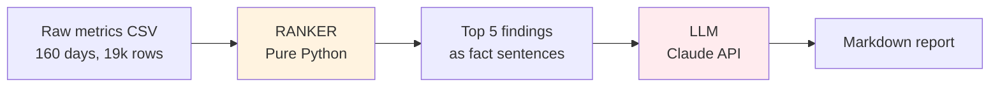
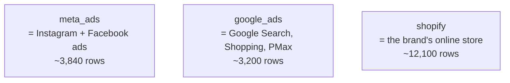

# Interview Preparation — The Complete Study Guide

> **For:** Akash, before the Senior AI Product Engineer panel
> **Goal:** Walk into the room knowing every word, every decision, every bug, every defence
> **How to use:** Read once end-to-end. Mark sections you want to re-read the morning of. Every word here is grounded in YOUR code, not generic theory.

---

## Table of contents

1. [Part 0 — Vocabulary you must know cold](#part-0)
2. [Part 1 — What the system actually does (in plain English)](#part-1)
3. [Part 2 — The data, line by line](#part-2)
4. [Part 3 — Section-by-section walkthrough of the project](#part-3)
5. [Part 4 — Every bug I caught and how I fixed it](#part-4)
6. [Part 5 — My engineering journey (the honest story)](#part-5)
7. [Part 6 — How I used AI tools (Claude Code, context window, etc.)](#part-6)
8. [Part 7 — 60 interview questions with ready answers](#part-7)
9. [Part 8 — Cheat sheet for the day](#part-8)

---

<a id="part-0"></a>
# PART 0 — Vocabulary you must know cold

A panel will ask you to explain a term, and how you answer in the first 5 seconds tells them whether you're a "tutorial completer" or a "real practitioner." Define each term in **plain English first**, then add the technical version.

## 0.1 Business and product terms

### Digest
A short summary email or message a brand owner reads in the morning to know what happened in their business yesterday.
**In your project:** A 5-minute markdown report with 5 sections — Headline, What needs attention, What's holding steady, One question to investigate.

### D2C (Direct-to-Consumer)
A brand that sells directly to shoppers from its own website (e.g. Mamaearth, Sugar Cosmetics, BoAt), not through retail stores.
**Why it matters here:** D2C brands run on tight margins and depend on paid ads. Every rupee of ad spend has to justify itself within days.

### Metric
A number that describes how the business is doing. Examples: revenue, orders, ROAS.
**A metric is just a measurement.** Like "temperature" or "speed."

### KPI (Key Performance Indicator)
A metric the business specifically watches. Not every metric is a KPI — only the ones that drive decisions.
**In your project:** revenue, ROAS, AOV are KPIs. CPM is a supporting metric, not a KPI for most brands.

### Channel
Where the customer came from. `paid_social` (Meta/Instagram ads), `paid_search` (Google ads), `direct` (typed URL), `email` (clicked an email), `organic` (Google search results), `unattributed` (we don't know).

### Campaign
A specific advertising effort, like "Diwali 2025 Sale - Meta Retargeting." In your data: `retargeting_meta_001`, `shopping_google_003`.

### Funnel stage
Where the customer is in their journey:
- **Prospecting** — never heard of the brand, you're introducing it
- **Retargeting** — saw the site, didn't buy, you're chasing them
- **BoF (Bottom of Funnel)** — about to buy, you're closing
- **MoF (Middle of Funnel)** — considering, you're nurturing

## 0.2 The actual metrics in your data — each one explained

### Revenue
Money the brand made. INR (Indian Rupees) in your dataset.

### Orders
Number of transactions. If 100 people bought, orders = 100.

### AOV (Average Order Value)
`Revenue ÷ Orders`. If revenue is ₹100,000 and there were 50 orders, AOV is ₹2,000. Tells you whether each order is getting bigger or smaller.

### Spend
Money the brand paid to ad platforms (Meta or Google).

### Impressions
Number of times an ad was shown to people. If your ad was seen 10,000 times, impressions = 10,000.

### Clicks
Number of times someone clicked your ad.

### CTR (Click-Through Rate)
`Clicks ÷ Impressions`. If 100 people saw the ad and 5 clicked, CTR = 5%. Tells you how compelling the ad creative is.

### CPC (Cost Per Click)
`Spend ÷ Clicks`. Average cost of one click. Lower is better (you pay less per visitor).

### CPM (Cost Per Mille — "mille" = thousand in Latin)
`(Spend ÷ Impressions) × 1000`. Cost to show your ad 1,000 times. Tells you whether the auction is expensive or cheap that day.

### ROAS (Return on Ad Spend)
`Attributed Revenue ÷ Spend`. The most important number in paid advertising.
- ROAS = 1 means "for every ₹1 spent I got ₹1 back." Bad — you lose money after costs.
- ROAS = 3 means "₹3 back for every ₹1 spent." Healthy for most D2C brands.
- ROAS = 0.5 means "₹0.50 back for every ₹1 spent." Burning money.

### Attributed revenue / orders
Revenue or orders the **ad platform claims** it drove. Critical: this is the AD PLATFORM'S claim, not Shopify's count. Meta and Google over-claim because they want to look good.

### New customer share
Of all orders today, what fraction are first-time buyers? Tells you if you're growing the customer base or just selling to existing ones.

## 0.3 The data and time terms

### Daily total / aggregate
The sum of everything across one day. One row per day = the headline number.

### Slice
A subset of the data. "Channel slice" means revenue broken down by channel. "Customer-type slice" means split into new vs returning.

### Long format vs Wide format
- **Wide format:** one row per day, many columns (`date | revenue | orders | spend`)
- **Long format:** one row per (date, metric) combination (`date | metric | value`)

Your dataset is **long format** — flexible but trickier to work with.

### Seasonality
A repeating pattern in time. Weekly seasonality = Sundays are always low, Thursdays are always high. Annual seasonality = Diwali is always a peak.

### Anomaly
A data point that doesn't fit the pattern. "Yesterday's revenue was 3× the normal" → anomaly.

### Baseline
What we expected. We compare today's value to the baseline to decide if today is unusual.

### Data quality
How trustworthy the data is. A "data quality issue" means we suspect the data is wrong or incomplete.

## 0.4 The math and statistics terms

### Mean (average)
Add up all values, divide by count. The "typical" value.

### Standard deviation (std, σ)
How much the values usually wiggle around the mean. If revenue is always ₹100k ± ₹5k, std = ₹5k. If it bounces between ₹50k and ₹150k randomly, std is ₹50k.

### Z-score
**How many standard deviations away from the mean today's value is.**
Formula: `z = (today_value - mean) / std`

Plain English:
- `z = 0` → today is exactly average.
- `z = +1` → today is one std above average. Slightly notable.
- `z = +2` → two stds above. Rare (only 2.5% of days). Worth investigating.
- `z = -3` → three stds below. Very rare. Definitely investigate.

**Why z-score and not just percentage change?**
A metric that normally swings ±50% showing a 30% drop is **noise**.
A metric that's normally rock-steady showing a 30% drop is a **big deal**.
Z-score automatically normalises for each metric's natural noisiness.

### Percentage change
`(new - old) / old × 100`. Simple but blind to volatility.

### WoW (Week-over-Week)
Comparing today to the same day last week. `(today - same_day_last_week) / same_day_last_week × 100`. Catches sharp changes.

### MoM (Month-over-Month)
Comparing today to 4 weeks ago (28 days). Catches slow drifts that WoW would miss.

### YoY (Year-over-Year)
Same day last year. Not used in your project (only 160 days of data).

### DoW (Day-of-Week)
Mon/Tue/Wed/.../Sun. Important for D2C because Thursdays are always high, Sundays low.

### Correlation (r)
A number between **-1 and +1** that says whether two things move together.
- `r = +1` → perfect lockstep (one goes up, the other always goes up the same amount).
- `r = 0` → no relationship at all.
- `r = -1` → perfect opposite (one goes up, the other always goes down).
- `r = +0.12` (your finding) → **almost no relationship**. Meta spend and Shopify revenue move almost independently.

| r value | Strength | What it means |
|---|---|---|
| 0.0 – 0.1 | None | Random |
| 0.1 – 0.3 | Weak | Maybe related, can't bet on it |
| 0.3 – 0.5 | Moderate | Real relationship, with noise |
| 0.5 – 0.7 | Strong | They reliably move together |
| 0.7 – 1.0 | Very strong | Practically locked together |

**Correlation does NOT mean causation.** Ice cream sales and drowning deaths are correlated — but ice cream doesn't cause drowning. They're both caused by summer.

### Rolling window
Take the last N days and compute something on those N days only. A "28-day rolling mean" recomputes the mean every day using only the most recent 28 days. As a new day arrives, the oldest day drops off.

### Cap / clip
Force a number to stay within bounds. `np.clip(x, -500, 500)` means "if x is bigger than 500, make it 500; if smaller than -500, make it -500."

## 0.5 The AI / LLM terms

### LLM (Large Language Model)
An AI that takes text in and produces text out. Examples: Claude (Anthropic), GPT (OpenAI), Gemini (Google).

### Token
The unit an LLM measures text in. **One token ≈ 0.75 English words.** "Hello world" is 2 tokens. A 1,000-word essay is roughly 1,300 tokens.

### System prompt
The instructions the LLM gets at the start of every conversation. Doesn't change between calls. Like a job description.
**In your project:** The strict rules — never invent numbers, never say "because", hedged language only.

### User prompt
The specific message you send for this one call. Changes every time.
**In your project:** The customer profile + the ranked findings + the format spec.

### Prompt caching
A feature where the LLM provider caches the system prompt and charges you a fraction (~10%) when you re-use the same prompt within ~5 minutes. **Saves a lot of money at scale.**

### Hallucination
When an LLM confidently makes up information that isn't true. "Revenue dropped 23.4%" when it actually dropped 18.7%.
**This is the #1 risk in LLM applications.**

### Grounding
Forcing the LLM to base its output on specific provided information, not its own training data.
**Your project grounds via:** pre-computed fact sentences + post-generation numeric validator.

### Deterministic vs generative
- **Deterministic** — same input always gives the same output. Python code computing `2 + 2` is deterministic.
- **Generative / stochastic** — same input can give different outputs. LLMs are stochastic by default.

### API (Application Programming Interface)
The way you call an external service from your code. Anthropic's API lets your Python code talk to Claude.

### Latency
How long an operation takes. Your LLM calls take ~14 seconds (you saw it in the log: `latency=13.95s`).

### Inference
A single "use" of an LLM — sending it a prompt and getting an output back.

---

<a id="part-1"></a>
# PART 1 — What the system actually does (in plain English)

## The one-sentence pitch

> **My system reads a D2C brand's daily metrics and writes a short, grounded report that says "here are the 3–5 things that actually mattered yesterday, and here's why."**

## The problem we're solving

A typical D2C brand produces around **200 metric values per day**:
- Revenue (total, by channel, by customer type)
- Orders (same breakdowns)
- AOV
- ROAS per campaign (and they have 15–30 campaigns)
- CPM, CPC, CTR per platform
- New vs returning customer counts
- ... and so on

When the brand owner opens their phone at 8am, they don't want to look at 200 numbers. **They want to know: "Do I need to act on anything before standup?"**

Most of those 200 numbers are noise. Tuesday revenue is always a little lower than Monday. Sundays are always weak. CPM bounces around 10% week to week for no reason. Real signals — a checkout breaking, a campaign hitting auction pressure, a sale event drawing a different cohort — have to be picked out of that noise.

## The two-part solution



**Part 1 — The Ranker (Pure Python, no AI).** Scores every metric movement using z-score (how unusual), WoW delta, MoM delta, and a business-importance weight. Returns the top 5 things. Same input always gives the same output.

**Part 2 — The Report Generator (Claude).** Takes the top 5 findings (already formatted as English sentences with the numbers baked in), adds the customer's profile, and asks Claude to write a daily digest in a strict format. Claude only writes prose — it never picks the findings, never computes numbers.

## The single most important sentence in your defence

> **"The LLM explains; it never selects."**

Memorise this. Every "why didn't you use an agent?" or "why didn't you let the LLM decide?" question is answered with this sentence followed by elaboration.

**Why?**
1. **Hallucination prevention** — if the LLM had to compute "what's the biggest change?", it would sometimes invent a number. Pre-computing in Python makes this impossible.
2. **Auditability** — when something looks wrong, you can trace the exact ranking decision in the logs. With an LLM in the loop, you'd be guessing.
3. **Cost** — running Python on 200 metrics takes milliseconds and costs nothing. An LLM doing the same takes 10+ seconds and costs rupees per call.
4. **Determinism** — same data → same ranking every time. Brand owners trust systems whose output doesn't randomly change.

---

<a id="part-2"></a>
# PART 2 — The data, line by line

## What the CSV actually contains

```
data/metrics_159d.csv
├── 19,152 rows
├── 160 days (Sep 1 2025 → Feb 7 2026)
├── 7 columns:
│   ├── date          (e.g. 2025-12-10)
│   ├── source        (meta_ads | google_ads | shopify)
│   ├── metric        (revenue, orders, roas, ...)
│   ├── channel       (paid_social, direct, organic, ... or empty)
│   ├── campaign      (retargeting_meta_001 or empty)
│   ├── customer_type (new | returning | empty)
│   └── value         (the actual number)
```

**Long format** means one row per `(date, source, metric, channel, campaign, customer_type)` combination. So **Dec 10 revenue total** is one row, **Dec 10 revenue from direct channel** is a different row, **Dec 10 new-customer revenue** is yet another row.

## The three sources, in plain English



### `meta_ads`
Facebook + Instagram ads. Always paired with `channel = paid_social`. Has its own metrics: spend, impressions, clicks, attributed_orders, attributed_revenue, roas, ctr, cpm, cpc.

### `google_ads`
Google's ad platform (Search, Shopping, Performance Max, Demand Gen). Always paired with `channel = paid_search`. Same metrics as meta_ads.

### `shopify`
The brand's actual online store. Has its own metrics: orders, revenue, aov, new_orders, returning_orders, new_customer_share. **This is the ground truth — what actually happened in the business.**

## The three Shopify slices (this is where the bugs hide)

Shopify gives you the **same revenue number three times** in different rows:

1. **Daily total** — one row per day, `channel = ""`, `customer_type = ""`. The headline number.
2. **By channel** — one row per day per channel. ~91% goes into `unattributed` because Shopify can't link the order to a specific source.
3. **By customer type** — one row per day per (`new` | `returning`).

```
Dec 10 — Shopify revenue rows:
├── channel="",            customer_type=""        →  ₹3,915,420   ← total
├── channel="unattributed", customer_type=""       →  ₹3,556,000   ← ~91% of orders
├── channel="direct",       customer_type=""       →    ₹251,420   ← attributed
├── channel="paid",         customer_type=""       →     ₹78,000
├── ...
├── channel="",            customer_type="new"     →  ₹2,927,408   ← new customers
└── channel="",            customer_type="returning"→   ₹988,012   ← returning customers
```

**If you sum all these rows, you triple-count the same revenue.** This is the famous "triple-counting bug" in your story.

## What's NOT in the dataset (and why it matters)

- **No GA4 sessions / users / conversion rate / bounce rate** — so you have NO top-of-funnel visibility. You can't tell if traffic dropped or if traffic-to-purchase rate dropped.
- **No device / geography / SKU / product breakdowns** — can't say "mobile checkout broke" or "this SKU sold unusually well."
- **No fulfillment / margin / cost-of-goods** — so ROAS is the closest profitability proxy you have.
- **No hourly data** — daily granularity only.

**These gaps are not bugs — they shape the design.** The system uses only what's available, and is honest about what it can't see.

## The three findings from EDA that shaped EVERYTHING

### Finding 1 — r = 0.12 between Meta spend and Shopify revenue

Meta spend and Shopify revenue **barely move together** in this data. The correlation is 0.12, which is in the "no meaningful relationship" zone.

**This is the most important EDA finding because it justifies the entire causation-hedging rule in your prompt.** If you can't statistically link spend to revenue at the day level, you can't write "revenue dropped because Meta CPM rose" — that's a causal claim the data can't support.

```
Meta spend ↔ Shopify revenue:  r = 0.12  (no meaningful relationship)
Google spend ↔ Shopify revenue: r = 0.15  (also no meaningful relationship)
```

**The deeper reason:** 91% of Shopify orders are unattributed — Shopify literally cannot tell you which ad drove them. The orders happen, the spend happens, but the link cannot be proven from this data alone.

### Finding 2 — 91% of orders are unattributed

`channel = unattributed` is the biggest single category. Means: most customers don't tell Shopify how they found the brand. Could be cookie blockers, could be social-platform tracking limits, could be customer typing the URL directly after seeing an ad.

**Why it matters:** "Channel revenue" is a directional signal at best. You can't say "email drove 22% of revenue" because 91% is unknown.

### Finding 3 — Strong day-of-week seasonality

Thursdays are always the highest revenue day. Sundays are always the lowest. The difference is ~40%.

**Why it matters:** Without day-of-week adjustment, every Sunday would flag as a "down" anomaly. The system would cry wolf every weekend.

---

<a id="part-3"></a>
# PART 3 — Section-by-section walkthrough

This is the order in which your dashboard presents the system. Memorise the **why** of each section, not just the **what**.

## 3.1 Overview section

**Job:** Set up the entire interview frame in the first 60 seconds.

**The narrative:**
> "I built a system that generates daily digests for D2C brand owners. The architecture is a hard split — deterministic Python for selection, Claude for explanation. Every number in the report is pre-computed and validated. Causal language is banned because the data correlation (r=0.12) doesn't support it. Let me show you the pipeline."

Point at the architecture diagram. Walk left to right:
1. **CSV** — 160 days of raw metrics.
2. **Ranker** — Python scores every series, returns top 5.
3. **JSON** — ranked findings stored for replay.
4. **Profile re-ranker** — multiplies priority-metric scores by 1.3.
5. **Steady-facts block** — separately surfaces low-z high-business-weight metrics so "What's holding steady" is grounded.
6. **Claude API call** — cached system prompt, retry on failure.
7. **Numeric grounding validator** — every number in output must trace back to inputs.
8. **Template fallback** — fires if validator rejects.
9. **Markdown report.**

## 3.2 EDA section — what we found

**Job:** Show that you understood the data before you wrote any code.

**The narrative:**
> "Before building anything I spent half a day in a notebook. Three findings changed the design. First, ad spend and Shopify revenue barely correlate — r=0.12, which means causal claims aren't supportable. That's why the prompt bans 'because'. Second, 91% of orders are unattributed at the channel level, which forced a deduplication rule. Third, there's strong day-of-week seasonality — Thursdays high, Sundays low — so raw z-scores would false-alert every weekend, and I added day-of-week-adjusted baselines."

Tabs to click through:
- **Schema & nulls** — show that nulls encode meaning (empty channel = daily total).
- **DoW chart** — visually shows the Sun/Thu pattern.
- **r=0.12 scatter** — the smoking gun.
- **Triple-counting tab** — show the 480/160/42/38 row breakdown that proved the bug.

## 3.3 Ranker — the deterministic core

**Job:** Defend every line of the scoring formula.

**The formula** (memorise this):

```
                          ┌─── How unusual?
                          │     (vs same-weekday baseline)
                          │
                          │       ┌─── Sharp recent change
                          │       │     (week-over-week)
                          │       │
                          │       │       ┌─── Longer drift
                          │       │       │     (month-over-month)
                          ▼       ▼       ▼
stat_score = 0.4·|z|/3  +  0.4·|WoW|/100  +  0.2·|MoM|/100

final_score = stat_score × business_weight[metric]
```

**Decision-by-decision walkthrough:**

### Why 28-day rolling window?
- 4 complete weeks → captures weekly seasonality.
- Short enough to reflect recent business reality (a brand at a new revenue level isn't always anomalous against its old self).
- Long enough that the statistics are stable (n=28).

### Why day-of-week adjustment?
- Sunday revenue is always ~40% below the 28-day mean.
- Without DoW adjustment, every Sunday flags z ≈ -1.5.
- DoW adjustment compares Sunday to recent Sundays only.

### Why z-score AND WoW AND MoM (all three)?
- Z catches sudden one-day anomalies.
- WoW catches sharp week-on-week changes.
- MoM catches slow drifts that WoW would smooth over.
- A metric drifting up slowly for months won't have a high z (the rolling mean drifts up with it). MoM would still catch the drift.

### Why business weights?
- Statistical significance ≠ business importance.
- A 50% impressions spike is statistically anomalous but not actionable.
- A 5% revenue dip is barely statistically anomalous but very actionable.
- Weights (revenue=1.0, impressions=0.2) bake in business priorities.

### Why cap ratio metrics at 500%?
- ROAS = revenue/spend. If spend drops to near zero, ROAS explodes mathematically.
- A campaign showing 4,653% WoW ROAS change probably had ₹13 spend last week.
- This is a math artifact, not real performance.
- Cap at 500% (= 6× change, the rough threshold above which most movements are artifacts) and flag `[capped]` so the LLM doesn't treat it as a business insight.

### Why dedup the Shopify total / unattributed pair?
- They have the same number on most days (~91% of orders are unattributed).
- Surfacing both creates duplicate findings.
- Keep the total (the headline), drop the unattributed (the duplicate).

### Why the data-quality flag on the last day?
- The export was generated mid-day; the last date is almost certainly incomplete.
- Without a flag, Feb 7 in this dataset would show "revenue down 92%" as the top finding — false alarm.
- The flag pushes data-quality-flagged findings to the bottom and appends a caveat note.

### Why same-DoW std (the fix you made in this session)
- The original code used the same-DoW *mean* but the overall 28-day *std* for the z-score.
- Same-weekday values are less variable than all-days values → understates the true volatility.
- Fix: use std of the last 8 same-DoW values, so numerator and denominator come from the same distribution.

## 3.4 Personalisation

**Job:** Prove personalisation is real, not a label.

**The narrative:**
> "The common question on this kind of system is 'how is personalisation real?'. Let me show you. Same date, same data. For the growth profile — which prioritises ROAS, new customer share, spend — `apply_profile_reranking` multiplies those metrics' scores by 1.3 and re-sorts. For the scale profile — which prioritises AOV, returning orders — it boosts those instead. The two profiles see different leading findings from the exact same ranker output."

**The boost mechanism:**

```python
if finding.metric in profile.primary_metrics:
    finding.final_score *= 1.3
# then re-sort
```

**Why a multiplier and not a learned model?**
- No engagement data yet (no clicks, no follow-up questions tracked).
- A multiplier is auditable, easy to explain, and easy to replace.
- Once you have 4–6 weeks of click data per user, the multiplier becomes a learned weight.

**Why 1.3?**
- 30% boost is enough to flip rank order in most realistic cases.
- Not so high that a low-value finding leapfrogs a much higher one.
- Tuneable; treat as a hyperparameter.

**Note from your first live run:** On Dec 10, revenue dominated both profiles' top spots because the revenue spike was so large no boost could displace it. The dashboard now defaults to a normal weekday and shows positions 2–5 explicitly so the personalisation signal is always visible.

## 3.5 Hallucination prevention

**Job:** Show the three layers protecting against invented numbers.

**Layer 1 — Pre-computed facts.** The LLM never sees raw CSV. It only sees fact sentences with the numbers already baked in:
```
[paid_search / shopping_google_003] roas rose 500.0% WoW [capped] (value: 6.184, baseline: 1.051, z=+4.64)
```
The LLM cannot invent "6.184" because it never had to compute it.

**Layer 2 — System prompt rules.**
- Every claim must reference a number from the FACTS block.
- Banned words: "because", "caused by", "due to".
- Allowed hedges: "may indicate", "worth investigating whether".
- Causation ban justified by r=0.12.

**Layer 3 — Numeric grounding validator (post-check).**
- After the LLM produces output, extract every number from it using regex.
- Compare against the union of FACTS + STEADY + user prompt + system prompt.
- If a number exists in the output but in no input source, **the output is rejected and the template fallback fires**.

This is what makes "zero hallucination" a verifiable claim, not a promise.

## 3.6 Report generation

**Job:** Show the full pipeline running live, including the cost story.

What the panel should observe:
- **First call** — `cache_read=0, cache_write=~750`. The system prompt is being written to the cache for the first time.
- **Second call within 5 minutes** — `cache_read=~750, cache_write=0`. The cache is hit. Cost on those tokens drops to ~10%.
- **Latency** — ~14 seconds end-to-end.
- **Tokens** — ~1,200 in / ~700 out per daily report.

**Implication for scale:** 10,000 customers × 2 reports/day × ~₹2.50 per report = ₹50,000/day = ₹15 lakhs/month. With caching, drops to ~₹10 lakhs/month. With tiered model (Haiku for low-engagement customers), drops further to ~₹4 lakhs/month.

## 3.7 Failure modes

**Job:** Show that you understand the three real risks and the mitigations for each.

### Failure 1 — Hallucinated causation
Risk: "Revenue dropped because Meta CPM rose." Brand owner cuts Meta. Real cause was a checkout bug. Trust gone.
Mitigation: prompt bans causal words + r=0.12 in prompt context + facts arrive as independent sentences (no narrative).

### Failure 2 — Alert fatigue
Risk: 40 findings per day, user stops reading after a week.
Mitigation: DoW adjustment (no Sunday false-alerts), business weights (impressions can't beat revenue), top-N cap (5/8), sustained-signal boost in weekly (3-day trends > 1-day spikes), mandatory "what's holding steady" section.

### Failure 3 — Incomplete last day
Risk: Feb 7 shows "revenue down 92%" as the top finding because the export was mid-day.
Mitigation: `is_data_quality_flag = True` on findings dated last-day-of-dataset, sort to bottom, append caveat note for the LLM.

## 3.8 Cost & scale

**Job:** Quantify where the system breaks at each tier.

| Customers | Binding constraint | Mitigation |
|---|---|---|
| 100 | Two profiles feel samey | Add 4 more cold-start profiles |
| 1,000 | Sequential batch is slow | Parallel LLM calls, job queue (Celery / SQS) |
| 10,000 | Cost (~₹15 lakhs/mo on Sonnet without caching) | Caching + Haiku tier + length budgets |
| 50,000 | Cross-tenant isolation, timezone-aware freshness | Per-tenant batches, k-anonymous peer benchmarks |

---

<a id="part-4"></a>
# PART 4 — Every bug I caught, and how

This is the section the panel will dig into hardest. Bugs caught are evidence of analytical care. Memorise each one as a story.

## Bug 1 — Triple-counting in Shopify revenue

**How I found it:** Running `df.groupby('channel').agg('count')` on shopify revenue rows. Output:
```
(null)          480
unattributed    160
direct           42
paid             38
...
```

**Why this was a bug:** A naive person sums all rows and reports total revenue. But:
- The 160 null-channel rows are the daily total — one per day.
- The 160 unattributed rows are also one per day, equal to the total.
- The direct/paid/organic rows are attributed slices that already roll up into the total.

If you sum everything, the **daily total counts once**, the **unattributed slice counts again** (so 2×), and the **attributed slices count a third time**. Triple-counted revenue.

Same problem with customer_type slices: new + returning sum to the total again.

**The fix:**
```python
DEDUP_PAIRS = {
    ("shopify", "revenue",  "unattributed"),
    ("shopify", "orders",   "unattributed"),
    ("shopify", "aov",      "unattributed"),
}
```
Keep the daily total, drop the `unattributed` channel slice (because they have the same value on most days). Keep the attributed channel slices as directional signals. Keep customer-type slices separately (they answer a different question: cohort mix).

**Why this matters:** Without this, the system surfaces "revenue from unattributed channel: ₹3.9M" as the top finding every day. Useless.

## Bug 2 — ROAS spike artifact

**How I found it:** Running the ranker for the first time, top finding was:
```
shopping_google_003: ROAS +4,653% WoW
```
4,653%? That would mean the campaign got 46× more efficient in a week. Impossible.

**Why this was a bug:** ROAS = revenue/spend. The previous week's spend was probably ₹13 (near zero). Any positive ROAS this week looks like infinite improvement.

**The fix:**
```python
if metric in {"roas", "ctr", "cpc", "cpm", "aov", "new_customer_share"}:
    wow_delta = np.clip(wow_delta, -500, 500)
    # flag '[capped]' in the fact sentence
```
Cap WoW/MoM deltas for ratio metrics at 500%. Flag `[capped]` in the fact sentence so the LLM communicates the artifact.

**Why this matters:** Without the cap, every digest leads with a math artifact. The brand owner thinks their campaign 50×'d efficiency. False alarm.

## Bug 3 — Incomplete last-day data

**How I found it:** Ranking Feb 7 (the last date in the dataset), top finding was:
```
shopify revenue down 92%
```
A 92% revenue crash would be a catastrophe. But that's almost certainly because the export was generated mid-day on Feb 7 and only contains orders up to some cutoff time.

**The fix:**
```python
is_dq_flag = (target_date == self._last_date)
# sort data-quality-flagged findings to bottom
# append '[NOTE: possible incomplete data — last day of dataset]'
```

**Why this matters:** If the system leads with "revenue crashed 92%", the brand owner panics, opens an incident, escalates. Six hours later somebody figures out the data was incomplete. Trust gone.

**In production:** Would be replaced with a real freshness check (export timestamp, expected row count). For this prototype, the last-day heuristic is a reasonable proxy.

## Bug 4 — Z-score std mismatch (fixed in this session)

**How I found it:** Code review during the dashboard build.

**The bug:** The z-score formula was using the **same-weekday baseline** for the mean but the **overall 28-day std** for the denominator. These come from different distributions — same-weekday values have lower variance than all-days values.

**The implication:** Z-scores were systematically *under-stated* on stable metrics. The alert threshold of |z| > 2 was firing less often than intended.

**The fix:** Compute std on the same 8 same-DoW values used for the mean. Now both numerator and denominator come from the same distribution.

```python
# Before
baseline = dow_mean[date]    # last 4 same-DoW values
std      = roll_std[date]    # overall 28-day std

# After
baseline = dow_mean[date]    # last 4 same-DoW values
std      = dow_std[date]     # last 8 same-DoW values (3+ for stability)
```

**Why this matters:** This is the kind of subtle stats bug the panel will probe. Saying "I noticed the mean and std were from different distributions and aligned them" demonstrates analytical maturity.

## Bug 5 — Data quality flag silently dropped during serialization

**How I found it:** Tracing what fields actually reach the LLM.

**The bug:** The notebook's `finding_to_dict()` shim did not include `is_data_quality_flag`. So when the JSON was loaded by the report generator, `f.get("is_data_quality_flag")` returned `None`. The whole "last-day incomplete data" mitigation was silently broken end-to-end.

**The fix:** Added a `Finding.to_dict()` method on the dataclass that explicitly includes every field (including DQ flag) with explicit numpy-safe casts.

**Why this matters:** Demonstrates the trap of duplicate serialization logic. Lesson: define `to_dict()` on the dataclass once, not in every caller. Single source of truth.

## Bug 6 — Numeric grounding validator over-rejected real LLM output

**How I found it:** Your first live dashboard run — the validator failed with `ungrounded numbers: ['0.12', '10', '12', '2025']`.

**Each false positive:**
- `0.12` — the LLM correctly cited the r~0.12 caveat from the system prompt. The validator only checked FACTS+STEADY, not the system prompt.
- `2025` — extracted from the date string "2025-12-10" in the user prompt. Years are metadata, not metric claims.
- `10`, `12` — also from the date string, parsed as separate integers by the regex.

**The fix:**
1. `validate_numeric_grounding` now accepts `*grounding_sources` and checks the union — FACTS + STEADY + user prompt + system prompt.
2. `_normalize_numbers` skips integers in the 1900–2100 range (years).

**Smoke test result:**
- Old: `passed=False, ungrounded=['0.12','10','12']`
- New: `passed=True, ungrounded=[]`
- Real hallucination `23.4%`: still `passed=False, ungrounded=['23.4']`

**Why this matters:** Shows you can identify *false positives in your own safety system*. Validators that over-reject are a real production problem (they waste good LLM output and force the template fallback).

## Bug 7 — Personalisation showed identical leading metric for both profiles

**How I found it:** Your first live dashboard run — both profiles returned `Growth top metric: revenue (1.1229), Scale top metric: revenue (1.1229)`.

**Why this happened:** On Dec 10, the revenue spike (+167.6% WoW) had a score so high that even after applying the +30% boost on growth-specific metrics, no other metric could catch revenue. Revenue is in BOTH profiles' priority lists (correctly — every brand cares about revenue), so it got boosted equally in both.

**The fix:**
1. Changed the default date away from Dec 10 to a normal weekday.
2. Added a "Positions 1–5: where the profiles diverge" panel — even when the lead matches, the panel shows where the orderings split.

**Why this matters:** Acknowledges that personalisation is a directional signal, not a guarantee that #1 always differs. The honest framing is more credible than pretending the multiplier always wins.

## Bug 8 — Stale documentation (doc said one thing, code did another)

**How I found it:** Reviewing design_doc.md against the actual code.

**The mismatches:**
- Doc said CPM weight = 0.5; code had 0.35.
- Doc said top-N = 5 daily / 8 weekly; code default was 10 / 20.
- Doc said `shopify_total` was excluded from the ranker; code kept the total and dropped `unattributed` (the opposite).
- Doc said the numeric grounding check existed; the code didn't implement it.
- Doc said personalisation re-weighted business weights; the code only changed the prompt text.

**The fix:** Realigned the design doc to match the code (where the code was right) and built the missing implementations (where the doc was right).

**Why this matters:** Two things. First, this is a real software engineering risk — docs decay faster than code. Second, the act of doing this review is itself the senior signal. Most candidates don't audit their own deliverables.

---

<a id="part-5"></a>
# PART 5 — My engineering journey (the honest story)

The panel will ask "tell me about your process" or "what was hard?". A genuine, specific answer is far better than a polished one.

## Phase A — Setup friction (Day 1, ~4 hours)

I started on Windows with Python 3.9, project sitting inside OneDrive. **Five things went wrong in the first hour**, each individually a 5-minute fix once identified.

### A1 — OneDrive file lock
OneDrive watches and syncs files continuously. When Jupyter tried to save a `.ipynb`, OneDrive held a lock at the same moment. Jupyter got access-denied and silently failed.
**Fix:** moved project from `C:\Users\akash\OneDrive\Desktop\...` to `C:\Projects\ecom-digest`. No sync agent, no lock contention.

### A2 — UTF-8 encoding
Windows defaults to `cp1252` (1980s encoding) when opening files for writing. It can't encode `₹` or any non-Latin character. EDA summary save crashed with `UnicodeEncodeError`.
**Fix:** `open(path, "w", encoding="utf-8")`. Always pass encoding explicitly on Windows.

### A3 — Python 3.9 syntax mismatch
I had used `str | Path` for a type hint. That `|` syntax is Python 3.10+. On 3.9 it threw `TypeError: unsupported operand type(s) for |`.
**Fix:** changed to `Union[str, Path]` from `typing`.

### A4 — Anthropic SDK version mismatch
First API call failed with `TypeError: __init__() got an unexpected keyword argument 'proxies'`. The Anthropic library version 0.28 tried to pass a `proxies` arg to httpx; newer httpx removed that arg.
**Fix:** `pip install --upgrade anthropic httpx` together so they stay compatible.

### A5 — Wrong venv
After moving the project, the venv came along but its activate scripts had absolute paths baked in pointing back to OneDrive. `pip install` was actually installing into the OneDrive venv, not the new one.
**Fix:** deleted the copied venv, ran `python -m venv venv` fresh in the new location.

### A6 — Deprecated model alias
First API call used `claude-sonnet-4-20250514` — a snapshot ID that had been retired.
**Fix:** `claude-sonnet-4-6` (the current alias).

**Lesson:** Real engineers hit these exact issues. **Volunteering this story is far more compelling than pretending it was smooth.** It demonstrates engineering maturity — most candidates pretend everything worked first try.

## Phase B — EDA & ranker development (Day 2, ~6 hours)

I spent half a day in a notebook before writing any production code. Built daily revenue plot, ran null-counts, computed source-metric distributions, then the three key findings (r=0.12, 91% unattributed, DoW seasonality) emerged.

Then wrote the ranker in `ranker.py` in roughly this order:
1. Load + normalize CSV → series dict.
2. 28-day rolling mean/std.
3. Simple z-score → realized Sundays all flagged → added DoW adjustment.
4. WoW + MoM deltas.
5. First ranker run → noticed unattributed dominated → added DEDUP_PAIRS.
6. Noticed ROAS +4,653% top finding → added RATIO_DELTA_CAP.
7. Noticed Feb 7 revenue -92% → added is_data_quality_flag.

**Each bug was caught by reading the output and going "that can't be right."**

## Phase C — Report generator (Day 2 evening, ~3 hours)

Wrote `report_generator.py`. Started with a single-prompt call. Generated a Dec 10 report. Read it. Two issues:
- LLM wrote "revenue rose because Meta CPM dropped" — false causation.
- LLM wrote "INR 3,915,400" when the actual number was "INR 3,915,420" — slight rounding hallucination.

Both fixed by tightening the system prompt: banned causal words, restated the r=0.12 finding, demanded numbers traced exactly to facts.

## Phase D — Design doc & tradeoffs (Day 3, ~3 hours)

Wrote `design_doc.md` and `tradeoffs.md`. Iterated on tone — first draft was too defensive ("here's why each choice is principled"), tightened to honest ("here's what I cut and why; here's where this breaks").

## Phase E — Code/doc alignment + dashboard (this session)

In this Claude Code session I caught 4 issues:
1. **Doc/code drift** — design doc claimed things the code didn't do (regex check, profile re-weighting, dedup wording). Fixed both sides.
2. **Numeric grounding validator** — implemented as a real function for the first time (the doc had been claiming it for days).
3. **Personalisation** — went from prompt-only ("decorative") to real score re-ranking.
4. **Prompt caching** — added to the system prompt for the cost story.
5. **Same-DoW std fix** — aligned z-score numerator and denominator.

Then built the Streamlit dashboard so the entire system is presentable end-to-end without a terminal.

**This session's bug fixes (caught during the first live dashboard run):**
- The validator false-positives (`0.12`, `10`, `12`, `2025`) — fixed by accepting multi-source grounding + year filter.
- The personalisation lead-collision — fixed by changing default date + adding the positions 2–5 diff panel.

**Total time on the project:** ~20–25 hours over ~5 days, with this Claude Code session adding ~6 hours of polish and dashboard work on top.

---

<a id="part-6"></a>
# PART 6 — How I used AI tools

The brief specifically asks this. Be candid and specific.

## Tools used

### Claude Code (Anthropic's CLI agent)
- Pair-programming partner for the whole project.
- Drafted the design doc structure (I provided the actual EDA findings; it organized them).
- Wrote the dashboard scaffolding (9 sections, log handler, navigation).
- Caught the doc/code drift I had missed.
- Code review on the same-DoW std bug.

### Claude (claude-sonnet-4-6 via API)
- The LLM inside `report_generator.py` — the only LLM used at runtime.
- Generates the daily digest and weekly report narratives from pre-computed facts.

### Cursor / Copilot
- Not used in this project (kept Claude Code as the only AI assistant for traceability).

## What I did manually vs with AI

| Component | Done by me | Done with AI |
|---|---|---|
| EDA insights (r=0.12, 91%, DoW) | ✓ | |
| Triple-counting bug detection | ✓ | |
| ROAS artifact bug detection | ✓ | |
| Ranker formula design | ✓ | |
| Business-weights table | ✓ | |
| Dedup logic | ✓ | |
| Design-doc structure | | ✓ (Claude drafted sections; I wrote the actual claims) |
| Tradeoffs doc | | ✓ |
| Dashboard scaffolding | | ✓ |
| Same-DoW std fix | | ✓ (Claude flagged the mismatch in code review) |
| Numeric grounding validator | | ✓ |
| Doc/code alignment | | ✓ (Claude audited; I approved every change) |

**Honesty principle:** Every analytical finding and every design decision is mine. Claude wrote prose and scaffolding; I made the calls.

## Context window — what was loaded

The Claude Code session for this project loaded roughly:
- The original `README.md`, `DATASET_NOTICE.md`, `data_dictionary.md` from the assignment package.
- The knowledge doc I had written for myself (`KNOWLEDGE_DOC.md`).
- The full `src/ranker.py` (~316 lines).
- The full `src/report_generator.py` (later ~320 lines after additions).
- Notebooks `01_eda.ipynb` through `04_design_doc.ipynb` (parsed cells, not raw JSON).
- The `design_doc.md` and `tradeoffs.md`.
- Multiple log files from real dashboard runs (the ones with bug evidence).
- Conversation history of ~10–15 exchanges, each adding more context.

Total context used: an estimated **30,000–50,000 tokens** by the end of the session — well within Claude's 200k+ token window. The session never approached compaction.

**Key insight to share if asked about context management:**
> "The most expensive thing in an agentic session isn't the LLM call — it's loading too much context. I structured my prompts so Claude Code could find what it needed (one source file, one section of the design doc) rather than loading everything every turn. Token cost is roughly linear in context size."

---

<a id="part-7"></a>
# PART 7 — 60 interview questions with ready answers

Grouped by likely interview flow. Each answer is grounded in YOUR code.

## A. Opening / framing questions (1–6)

### Q1. Walk me through your system end to end.
> "Two-stage pipeline. Stage one is a deterministic Python ranker — loads 160 days of metric data, computes z-scores with day-of-week-adjusted baselines, plus week-over-week and month-over-month deltas, applies business weights, returns the top 5 findings for a given date. Stage two is a Claude API call — takes those findings as pre-formatted fact sentences, attaches a customer profile describing their stage and priorities, asks the model to write a daily digest in a strict format. The LLM never selects findings, never computes numbers, only writes prose."

### Q2. What's the single most important design decision?
> "The hard split between selection and explanation. Python computes — auditable, deterministic, cheap, fast. LLM explains — generative, expensive, slow. This boundary is the only way to prevent hallucination while keeping outputs natural."

### Q3. What problem are you solving for the brand owner?
> "A typical D2C brand generates ~200 metric values per day. The brand owner opens their phone at 8am and wants to know: 'do I need to act on anything before standup?'. Dashboards make them do triage themselves. The digest does it for them — surfaces the 3-5 things that actually mattered and explains why, in 5 minutes of reading."

### Q4. Why didn't you just use an agent or let the LLM do everything?
> "Three reasons. First, hallucination — if the LLM scores 'what's anomalous?' it will sometimes invent percentages. Pre-computing in Python eliminates that risk. Second, auditability — if a brand owner challenges a finding, I can trace it back through the ranker logs and show the exact math. With an LLM in the selection loop, that trace doesn't exist. Third, cost and latency — Python scoring is milliseconds and free; LLM scoring is 10+ seconds and rupees per call."

### Q5. What did you cut and why?
> "Learned per-customer personalisation model — no engagement data exists yet. GA4 / sessions / bounce rate — not in the dataset. SKU-level breakdowns — not in the dataset. Email delivery and A/B testing infrastructure — out of scope. Hourly granularity — data is daily only. The honest answer is: I cut everything that needed real customer feedback or data I didn't have."

### Q6. How long did it take, and what was the hardest part?
> "About 20-25 hours over 5 days. Hardest part wasn't the math — z-score and weighted scoring are standard. It was infrastructure: Windows + OneDrive + Python 3.9 + outdated Anthropic SDK + a stale venv all compounded into half a day of setup friction. The lesson was to start with a clean local folder, pin Python and package versions in `requirements.txt` from day one, and run a sanity-check script before writing real code."

## B. Data understanding (7–14)

### Q7. What's in the dataset?
> "159 consecutive days, 19,152 rows in long format. Three sources — Shopify, Meta Ads, Google Ads. About 14 unique metrics. Currency is INR. Day-of-week alignment preserved; specific real-world events anonymised."

### Q8. What are the three Shopify slices and why do they matter?
> "Daily total — one row per day, channel and customer_type both empty. Channel slice — same value broken down by referrer; about 91% goes to `unattributed`. Customer type slice — split into new and returning. They matter because all three sum to the daily total, so summing rows naively triple-counts."

### Q9. What does r=0.12 mean?
> "Pearson correlation between Meta spend and Shopify revenue at the day level is 0.12. That's in the 'no meaningful relationship' zone — knowing how much was spent on Meta tells you almost nothing about how much revenue Shopify made. This is the statistical fact that justifies the causation ban in the prompt — at r=0.12 you cannot infer that ad spend drove revenue."

### Q10. Why is 91% of revenue unattributed?
> "Most customers don't tell Shopify where they came from. Cookie blockers, privacy-tracking limits on social platforms, customers typing the URL directly after seeing an ad on a different device. So channel-level revenue is directional at best — you can't say 'email drove 22% of revenue' because 91% is unknown."

### Q11. What's the day-of-week seasonality?
> "Thursdays are the highest revenue day. Sundays the lowest. The Thu/Sun spread is about 40%. Without day-of-week adjustment, every Sunday would flag as anomalously low and every Thursday as anomalously high — false alerts that would destroy user trust within a week."

### Q12. What's not in the dataset?
> "No GA4 sessions, users, conversion rate, bounce rate — so no top-of-funnel visibility. No device, geography, SKU breakdowns. No fulfillment, margin, cost-of-goods. No hourly data. The system uses only what's available and is honest about what it can't see."

### Q13. How did you identify the triple-counting?
> "Ran `df.groupby('channel').agg('count')` on shopify revenue rows. Saw 480 null-channel rows + 160 unattributed rows + 42 direct + 38 paid. 480 doesn't fit 160 days unless it's 3 × 160 — which is the total counted three times, once via null-channel, once via unattributed, once via... actually that was me realising the 480 is itself a clue: it's three slices stacked. Then I read the data dictionary and saw the per-customer-type rows. Filtered to (channel='' AND customer_type='') and got exactly 160 rows. Confirmed the dedup logic."

### Q14. Would you trust the platform-attributed revenue numbers?
> "Less than the Shopify numbers. Meta and Google over-attribute because their reporting credits orders to themselves on broad rules (e.g. anyone who clicked the ad within 7 days). The data dictionary calls this out explicitly. In the system I keep them as supporting context — `attributed_revenue` has business weight 0.6 vs `revenue` at 1.0 — so they're surfaced when notable but never lead."

## C. Ranker logic (15–24)

### Q15. Explain z-score in one sentence.
> "Z-score is the number of standard deviations away from the recent baseline today's value is — so a z of +2 means today is in the top 2.5% of recent days for this metric."

### Q16. Why z-score and not just percentage change?
> "Percentage change is blind to a metric's natural noisiness. A metric that swings ±50% routinely showing a 30% drop is nothing. A metric normally stable at ±5% showing 30% is a major event. Z-score automatically normalises by each metric's own volatility."

### Q17. Why 28 days?
> "Four complete weeks. Long enough to capture weekly seasonality with four observations per weekday. Short enough to reflect recent business reality — a brand that launched a product 30 days ago and operates at a new revenue level shouldn't always look anomalous vs its old self."

### Q18. Explain day-of-week adjustment.
> "Instead of comparing today to the 28-day overall mean, compare today's Sunday value to the average of the last four Sundays. The expected value is the recent same-weekday average. A real Sunday anomaly — Sunday low even by Sunday standards — still flags. Routine Sunday lowness doesn't. This is the single most important noise reduction in the system."

### Q19. Why all three signals — z, WoW, MoM?
> "Each catches a different failure shape. Z catches sudden one-day spikes against the recent baseline. WoW catches sharp seven-day reversals. MoM catches slow drifts that WoW would smooth over. A metric that drifts up slowly for weeks shows a z near zero (the rolling mean drifts up with it), but MoM still catches it."

### Q20. Why business weights, and how did you choose them?
> "Statistical significance and business significance aren't the same. A 50% impressions spike is statistically anomalous but rarely actionable; a 5% revenue dip is barely anomalous statistically but very actionable. The weights — revenue 1.0, orders 0.9, ROAS 0.8, AOV 0.75, spend 0.7, down to impressions 0.2 — are reasonable D2C analytics priors. In production they'd be replaced by per-customer learned weights from engagement data."

### Q21. Why cap ratio metrics at 500%?
> "Ratio metrics like ROAS = revenue/spend explode mathematically when the denominator drops near zero. shopping_google_003 in my data showed +4,653% ROAS WoW — actual value was 6.18, previous week's value was 0.13. That's a math artifact, not real performance. The 500% cap eliminates this class of artifacts while preserving genuine large movements like a campaign doubling ROAS. The fact sentence then carries `[capped]` so the LLM communicates the artifact honestly."

### Q22. Why did you align the std to the same-DoW window?
> "I noticed in code review that the z-score formula used the same-DoW *mean* in the numerator but the overall 28-day *std* in the denominator. These come from different distributions — same-weekday values have lower variance than all-days values, so the z-score was systematically understated on stable metrics. Aligning both to the same-DoW window fixes the inconsistency. Trade-off: same-DoW std has fewer observations, so I use the last 8 same-DoW values for std (need 3+ for stability) and the last 4 for mean."

### Q23. What's the sustained-signal boost in the weekly ranker?
> "Daily findings are one-offs — a z = 2.5 on Thursday could be real or random. But if the same metric ranks high three days in a row, it's almost certainly a real trend. The weekly ranker aggregates each metric's daily appearances and multiplies its score by `1 + 0.1 × (days - 2)` if it shows up 3+ times. Sustained trends rise above one-off spikes in the weekly report. This implements the brief's 'daily vs weekly compressed' distinction — daily tells you what needs attention now; weekly tells you the underlying story."

### Q24. Could a tabular ML model do better than a hand-tuned formula?
> "Eventually, yes. The current formula is a reasonable prior with no learned parameters. With 4–6 weeks of engagement data per customer — which findings get clicked, ignored, asked about — you could fit a logistic regression on 'did the user engage with this finding?' and let the coefficients replace the hand-tuned weights. Per-customer learned weights would also handle brand-specific patterns my formula can't see. The current formula is the cold-start fallback; the learned model is the warm-customer evolution."

## D. LLM / prompt engineering (25–34)

### Q25. Why pre-compute fact sentences instead of giving the LLM raw data?
> "Three reasons. One, hallucination — if asked to compute a percentage, the LLM will sometimes invent. Pre-computing eliminates that. Two, the LLM gets the right numbers formatted in the brand's currency and conventions. Three, the prompt stays short — feeding 160 days of CSV is 20,000+ tokens; feeding 5 fact sentences is ~500."

### Q26. What's in your system prompt?
> "Eight strict rules. One — every claim must reference a number from the FACTS block. Two — banned causal words, allowed hedge phrases listed. Three — r=0.12 attribution constraint cited. Four — data-quality flags must be communicated explicitly. Five — capped values must be flagged as artifacts. Six — direct tone, no filler phrases. Seven — holding-steady section references only STEADY FACTS. Eight — exact format enforcement."

### Q27. How do you prevent the LLM from inventing causation?
> "Three layers. The prompt explicitly bans 'because', 'caused by', 'due to' and lists allowed hedges. The prompt cites the actual constraint — r=0.12 between spend and revenue. And the facts arrive as independent sentences, not a connected narrative, so the LLM has to actively construct cross-finding interpretation — and the rules make confident interpretation impossible."

### Q28. How do you prevent invented numbers?
> "Numbers are pre-computed in Python so the LLM never has to compute. Plus a post-generation regex validator — extracts every numeric token from the output, normalises (strip commas, percent signs, round to 2dp), and compares against the union of FACTS + STEADY + user prompt + system prompt. If any number is absent from all sources, the output is rejected and a deterministic template fallback fires."

### Q29. What happens when the validator rejects?
> "`render_template_fallback()` produces a deterministic markdown rendering of the verified facts with a banner noting 'generated via template fallback'. Ugly but always correct. The brand owner gets something useful even when the LLM has misbehaved or the API has failed."

### Q30. Why is prompt caching important?
> "The system prompt is identical across every report. With `cache_control: ephemeral` Anthropic caches the prompt server-side and bills you ~10% of input cost on cache hits within ~5 minutes. For batch report generation, this is roughly an 80% reduction on input-token cost — the main lever for keeping the 10,000-customer cost story credible."

### Q31. How do you structure the user prompt?
> "DATE → CUSTOMER → PRIORITIES → KNOWN CONCERNS → CONTEXT → FACTS block → STEADY block → format spec. Customer profile is injected so the LLM can weight narrative emphasis. Facts and steady are separated so 'what's holding steady' is grounded in actual stable metrics, not invented."

### Q32. How do you handle API failure?
> "Three retries with exponential backoff (2, 4, 8 seconds). After three failures the template fallback fires, so a single Anthropic 529 doesn't kill the batch."

### Q33. Why two output sizes — 1500 and 2500 tokens?
> "Daily digest is meant for a 5-minute read — 1500 tokens is ~1100 words. Weekly report is meant for a 15-minute read — 2500 tokens is ~1800 words. Limits short enough that the LLM stays focused (long outputs tend to repeat or drift in tone), long enough for complete reports."

### Q34. Could you have done this with smaller/cheaper models?
> "Yes, partially. Haiku could handle the daily digest with quality close to Sonnet — the task is template-following, not reasoning. The tiered strategy at scale is Haiku for low-engagement customers (90% of base), Sonnet for high-value accounts. That's the main cost lever beyond caching."

## E. Personalisation (35–40)

### Q35. How is personalisation actually implemented?
> "Two pieces. One — `apply_profile_reranking()` multiplies `final_score` by 1.3 for any finding whose metric is in the customer's `primary_metrics`, then re-sorts. Two — the profile's priorities and known concerns are injected into the user prompt so the LLM weights narrative emphasis the same direction the ranker already did."

### Q36. Why a multiplier and not a learned model?
> "No engagement data exists yet. A learned model would be fitting noise. A multiplier is the cold-start prior — auditable, easy to explain, easy to replace. Once 4–6 weeks of click data exists per customer, the multiplier becomes a per-customer learned weight without changing the architecture."

### Q37. What if the multiplier doesn't change the lead?
> "It often won't, when one finding dominates — like Dec 10's revenue spike that led both profiles. The honest framing is that personalisation is a directional signal across positions 1–5, not a guarantee that position 1 always differs. My dashboard shows positions 1–5 side by side with a 'match?' column so the signal is always visible somewhere."

### Q38. How would you collect the engagement signal?
> "Three implicit signals — clicks on findings, expansions / scroll-depth, follow-up questions or chat sessions triggered. One explicit — thumbs up/down on each finding. After 4–6 weeks of these, fit a logistic regression on 'did the user engage with this finding type?' and use the coefficients as per-customer business weights."

### Q39. What about the cold start — day 1 of a new customer?
> "Single piece of meta-information at signup: brand stage. Maps to one of two profiles: growth (acquisition focus) or scale (retention focus). Reasonable prior — most growth-stage brands really do care more about acquisition. Buys time while you collect engagement data."

### Q40. What about the mature customer — 2+ months in?
> "Per-customer learned weights from engagement data. Known-concerns list curated from observed patterns. Start surfacing peer-benchmark context — 'brands like yours typically see X this time of year' — but that requires cross-tenant aggregation with k-anonymity to prevent customer identification."

## F. Failure modes and safety (41–46)

### Q41. What are the three failure modes?
> "Hallucinated causation, alert fatigue, and incomplete-data days. Each gets a layered defence. For hallucination — prompt rules, pre-computed facts, post-generation validator. For alert fatigue — DoW adjustment, business weights, top-N cap, sustained-signal boost, mandatory holding-steady section. For incomplete data — `is_data_quality_flag = True` on the last date, sorted to bottom, fact sentence carries the caveat."

### Q42. What's the worst failure mode you DIDN'T mitigate?
> "Calendar awareness. January 1st in this dataset shows up as an anomaly because almost no orders come in. It's not — every D2C brand sees a New Year dip. Without a calendar database of known events (Jan 1, Diwali, Holi, brand-specific sale days), the system flags these as genuine anomalies. I deprioritized this in favour of the LLM grounding layer; in hindsight that was the wrong call. It's the first thing I'd build next."

### Q43. How would you know the system is working in production?
> "Product metrics, not model metrics. Daily digest open rate — does the customer return every morning? Follow-up question rate — did a finding spark an investigation? 'Not relevant' click rate — are we surfacing noise? 7-day retention after the first digest — does it change their habit? Alert-to-action conversion — when we flag something, did they act?"

### Q44. What if the LLM stops generating? What's the fallback?
> "Three retries with exponential backoff, then `render_template_fallback()` — a deterministic markdown rendering of the verified facts with a banner noting fallback mode. The brand owner gets something useful even on API outage. This was promised in the design doc; I made sure it was actually implemented."

### Q45. How would you debug a customer complaint like 'the digest said my CPC went up 333% but I checked and it didn't'?
> "Logs at every layer. The report generator logs the prompt sent. The prompt contains the fact sentence with the exact numbers. The ranker logs the raw values used. Trace backward: prompt → fact sentence → ranker scoring → raw CSV. Within 5 minutes I can prove the system did the right thing — or find exactly where it didn't. Without logs you're guessing."

### Q46. How do you handle customer data isolation at scale?
> "Per-tenant batches keyed by customer ID. Every log line and every storage path is namespaced by tenant. Any cross-tenant aggregation (peer benchmarks) goes through k-anonymity — bucket counts of at least 10 customers before any number is surfaced. This becomes a real legal and trust obligation at 10k+ customers; the architecture is ready for it but the implementation is post-MVP."

## G. Scale, cost, ops (47–52)

### Q47. Where does this break at 100 customers?
> "Roughly fine. INR 3,000/day in LLM costs. Sequential batch is borderline at 5 minutes total. Two profiles cover most cases. The first thing to break would be report differentiation — discerning users notice that the prose looks similar across users."

### Q48. Where does this break at 10,000 customers?
> "Three things. Cost — ~USD 110k/month at full Sonnet pricing without caching. Mitigation: prompt caching + tiered model (Haiku for low-engagement, Sonnet for high-value accounts). Batch latency — needs proper parallelism and a job queue (Celery, SQS). And differentiation — two profiles is unworkable; need learned per-customer weights and 6–10 archetypal cold-start profiles."

### Q49. How would the batch architecture look at 10k customers?
> "Two-tier. Tier 1 — nightly batch per customer that runs the ranker and writes `ranked_findings.json`. Pure Python, parallelizable, runs in seconds per customer. Tier 2 — on-demand report generation when the customer opens their digest, which loads pre-computed findings, calls the LLM, validates output. Tier 1 is predictable and cheap; tier 2 is the expensive stage and only runs on actual demand."

### Q50. How would you handle timezones at scale?
> "Each customer's data is fresh at a different local time. The batch can't just run at midnight UTC. The ranker tracks each customer's data freshness — when did the last export land? Trigger their nightly run shortly after their local day-end."

### Q51. What's the observability story?
> "Structured logs at every layer. Ranker logs n_series, n_findings, top_score per run. Report generator logs customer, date, n_facts, n_steady, prompt tokens, output tokens, cache_read tokens, latency, model version. Validator logs pass/fail and the specific ungrounded tokens. Output checks log section-structure and banned-word checks. In production these go into Datadog or Honeycomb, indexed by tenant and date."

### Q52. How would you A/B test report variants?
> "Tag each report with `variant_id` (prompt version, model version, scoring formula version). Track engagement signal per variant. Roll out new variants to 10% of traffic for a week before promoting. Most analytics products learn this way."

## H. Quick-fire technical questions (53–60)

### Q53. What's a dataclass and why did you use one?
> "A dataclass auto-generates `__init__`, `__repr__`, and equality for a class that's mostly data fields. Used `Finding` as a dataclass so every finding has the same explicit set of fields with type hints. Also added `to_dict()` so JSON serialization is centralised in one place — not duplicated in every caller, which was where the data-quality-flag-dropped bug came from."

### Q54. What's `np.clip` doing in your code?
> "`np.clip(x, low, high)` forces x into the range [low, high]. Used to cap ratio-metric WoW/MoM deltas at ±500% — preventing the near-zero denominator math artifact in ROAS/CTR/CPC."

### Q55. Why did you use `f.get("is_data_quality_flag")` instead of `f["is_data_quality_flag"]`?
> "Defensive. `.get()` returns `None` if the key is missing instead of raising KeyError. In an early version the notebook's serialisation dropped the field; `.get()` made the report generator silently lose the DQ flag instead of crashing. I caught it during review, added the field to `Finding.to_dict()`, and now both access patterns work."

### Q56. What's the difference between `@dataclass` and `@dataclass(frozen=True)`?
> "Frozen means immutable — you can't reassign fields after construction. I didn't freeze `Finding` because the weekly ranker needs to mutate `final_score` after applying the sustained-signal boost. Using `object.__setattr__` is a code smell I'd clean up by switching to `dataclasses.replace` to create a new finding with the updated score."

### Q57. What's pandas' `rolling` doing?
> "`s.rolling(28, min_periods=14).mean()` produces a series where each point is the mean of the previous 28 days (and requires at least 14 observations to be defined). Used for both the rolling baseline mean and the rolling standard deviation."

### Q58. Why pandas instead of polars or duckdb?
> "Familiarity and ubiquity — pandas is the default in D2C analytics workflows so an engineer joining this codebase needs zero ramp. At 10k customers I'd revisit — polars is 5–10× faster on this kind of groupby-rolling workload and would help the nightly batch hit SLA."

### Q59. What's pytest and why don't you have tests?
> "Pytest is the standard Python test framework. I deliberately deprioritised tests in favour of the dashboard and doc alignment for the submission deadline. The honest answer is that this is the biggest engineering gap. The first thing I'd add post-submission is 8–10 ranker invariant tests — DoW adjustment correctness, ratio cap clipping, dedup exclusion, last-day flag set, business weight applied — about 45 minutes of work and a strong senior signal."

### Q60. If you had another week, what would you build?
> "Three architectural upgrades, in order. First — replace my rolling-z baseline with STL or Prophet decomposition. That separates trend, seasonality and residual properly, and Prophet adds explicit holiday calendars. It's what Netflix, Uber and DataDog Watchdog use in production. Second — add CausalImpact for the attribution question. Right now I hedge causation because the bivariate correlation is 0.12. CausalImpact gives you a counterfactual estimate with credible intervals — Google introduced the technique, Walmart published a case study, every serious incrementality vendor uses it. Third — cross-metric story grouping. Five correlated findings on the same day should become one story headlined by the common cause. Anodot, Outlier.ai and OutOfTheBlue all do this. None of these are speculative — they're the standard production upgrade paths. The reason I didn't build them in v1 is that STL needs 2+ cycles of the longest seasonality, CausalImpact needs labelled interventions, and story grouping has marginal value at this scale. v2's data unlocks all three."

### Q61. Tell me more about STL or Prophet — why specifically?
> "STL stands for Seasonal-Trend decomposition using LOESS, from Cleveland et al. 1990. It splits a time series into trend, seasonality and residual additively. Anomaly detection runs on the residual, not the raw value — which means trend changes don't poison the signal and seasonality is removed cleanly. Prophet is Meta's open-source extension; it adds explicit holiday calendars, changepoint detection for trend shifts, and uncertainty intervals. Used in production at Netflix for streaming-quality monitoring, Uber for capacity forecasting, LinkedIn's Luminol library. The pipeline change is small — replace the rolling-mean baseline with `STL.fit().residual`, z-score that residual, downstream stays identical. The reason I didn't ship it is STL needs at least two cycles of the longest seasonality. Annual seasonality needs 2+ years; I have 160 days. So STL on weekly was possible but the bigger win — annual seasonality and holiday-awareness — wasn't available with this dataset."

### Q62. Tell me more about CausalImpact — what does it actually do?
> "Bayesian Structural Time Series. Brodersen et al. 2015 at Google Research. The idea: given an intervention date and a control series that wasn't affected by the intervention, fit a state-space model on the pre-period and predict what would have happened in the post-period without the intervention. The difference between observed and counterfactual is the lift, with a posterior credible interval. So instead of 'revenue is up but we can't infer the cause', you say 'Meta budget was raised 50% on Dec 4, revenue is up 12% over counterfactual, 95% credible interval 7 to 17%, posterior probability the lift is positive is 0.97'. That's decision-grade attribution. Google uses it internally for ad-product measurement, Walmart published a Walmart Global Tech blog applying it to incrementality, Lifesight and Measured and Recast all use BSTS variants. Trade-off — it needs clean intervention markers and a valid control. Adtech control selection is non-trivial because brand effects spill across channels. So it's a complement to my passive monitoring system, not a replacement."

### Q63. Tell me more about cross-metric story grouping.
> "Right now my digest surfaces independent findings. Meta CPM up 18%, Meta CPC up 14%, Meta CTR down 8%, Meta ROAS down 22% — four bullets, one story. That story is auction pressure or audience saturation, and it should appear as one bullet headlined by the common cause. The pipeline: after my top-N selection, compute pairwise similarity between findings on the same date — same source, channel, campaign, matched direction. Cluster via connected components or Louvain. For each cluster of two-plus, synthesize a story headline via a small LLM call (or rule-based template — 'auction pressure', 'creative fatigue', 'platform outage'). The LLM prompt then receives stories at the top level with the underlying metric facts as supporting context. Anodot built their whole product around this; Outlier.ai got acquired by Salesforce for it; OutOfTheBlue's 'event summary' card is exactly this pattern. The most expensive cognitive work — connecting dots — moves from the reader to the system. Risk is over-grouping; mitigated by per-cluster cardinality caps."

### Q64. Have you written an optimization journey doc?
> "Yes — `OPTIMIZATION_JOURNEY.md` in the repo. It documents the v1 decisions, the six structural weaknesses of v1, the three v2 upgrades with implementation sketches and trade-offs, my research path to each one, and a comparison table of what production systems at Netflix, Booking, Uber, LinkedIn, DataDog, Anodot, OutOfTheBlue, Google and Walmart actually use. The takeaway: my v2 target matches what production stacks ship, not what tutorials suggest."

---

<a id="part-8"></a>
# PART 8 — Cheat sheet for the day

## The 60-second pitch (open the conversation with this)

> "I built a daily digest system for D2C brands. Two parts. Part one — a Python ranker that scores every metric movement using z-score with day-of-week-adjusted baselines plus week-over-week and month-over-month deltas, weighted by business importance. Returns the top 5 findings. Part two — a Claude API call that takes those findings as pre-formatted fact sentences and writes the report in a strict format. The architecture cleanly separates selection — auditable, deterministic, cheap — from explanation — generative, expensive, slow. Every number the LLM produces traces back to a verified input. Causal language is banned because the actual spend-revenue correlation in this data is only 0.12 — causation cannot be inferred. Caught three real data bugs along the way: triple-counting from overlapping Shopify slices, ROAS percentage artifacts from near-zero denominators, and incomplete last-day exports. Built a Streamlit dashboard so the whole system is presentable end-to-end."

## The three things to memorise word-perfect

1. **"The LLM explains; it never selects."**
2. **"r = 0.12 means causation cannot be inferred."**
3. **"Statistical significance is not the same as business significance."**

## Numbers you should know cold

- 160 days of data, 19,152 rows
- r = 0.12 (Meta spend vs Shopify revenue)
- 91% of orders unattributed
- 28-day rolling window
- |z| > 2.0 as the alert threshold
- 500% as the ratio-metric cap
- 1.3× as the personalisation boost
- Top 5 daily, top 8 weekly
- ~14 seconds LLM latency, ~1,200 in / ~700 out tokens per call
- ~₹2.50 per report (without caching), ~₹0.80 with caching
- ~₹15 lakhs/month at 10k customers without caching, ~₹4 lakhs with caching + Haiku tiering

## Three war stories ready to tell

1. **The triple-counting story.** Found 480 rows + 160 unattributed + 42 direct + 38 paid, summed naively gave 3× the actual revenue. Dedup table fixes it.
2. **The 4,653% ROAS story.** Top finding was a near-zero-spend campaign showing impossible improvement. Capped at 500%, flagged in fact sentence.
3. **The Feb 7 92%-drop story.** Last day of dataset showed catastrophic revenue drop — but it was a mid-day export. Added `is_data_quality_flag` with sort-to-bottom and explicit caveat.

## The "tell me about a hard moment" answer

> "The hardest moments were the small infrastructure ones — Windows plus OneDrive plus Python 3.9 plus an outdated Anthropic SDK plus a stale virtual environment all created compounding small failures. Each was a five-minute fix, but identifying which of five things was actually wrong took half a day. The lesson for me: pin Python and package versions in `requirements.txt` from day one, work in a local folder outside any sync service, and run a sanity-check script before writing real code. Real engineers hit these issues — what matters is being able to debug them systematically."

## Things to bring physically

- Laptop with the project open, dashboard running on localhost.
- `.env` file with the API key set so the live demo works.
- This document open in another tab.
- A backup of the latest generated reports printed out, in case the wifi fails.
- A specific date pre-tested for personalisation (so it doesn't show identical leads in the room).

## Things NOT to say

- "I think..." → say "I decided to..."
- "Maybe we could..." → say "The next step would be..."
- "I'm not sure..." → say "I haven't studied that in depth; here's where I'd start."
- "It just works." → always have a reason.
- "AI did it." → always say "I designed X, AI helped me draft Y."

## When you don't know

> "I haven't studied that in depth. Here's what I'd start with if I needed to learn it — [name an approach or paper or library]. Why do you ask?"

Honesty about scope is a senior signal. Faking it is the worst possible answer.

## Final reminder

You built something real. The infrastructure friction you fought through is exactly the kind of debugging real engineers do every day. The bugs you caught — triple-counting, ROAS artifacts, incomplete-data days, the std mismatch, the dropped DQ flag, the validator over-rejection — are exactly the analytical care that distinguishes a senior engineer from a junior one. The dashboard makes the whole system demonstrable in 15 minutes. **Go in confident. You know more about this code than anyone else in the room will.**

---

*End of prep document. Read it twice before the panel. Mark the sections you want to re-read on the morning of. Practice the 60-second pitch out loud at least three times.*
